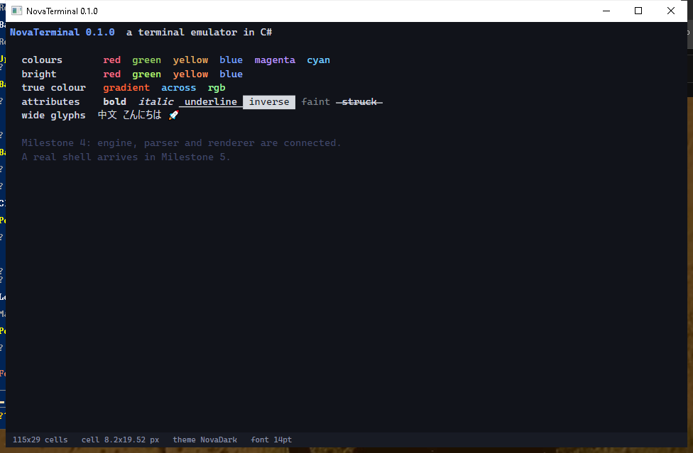
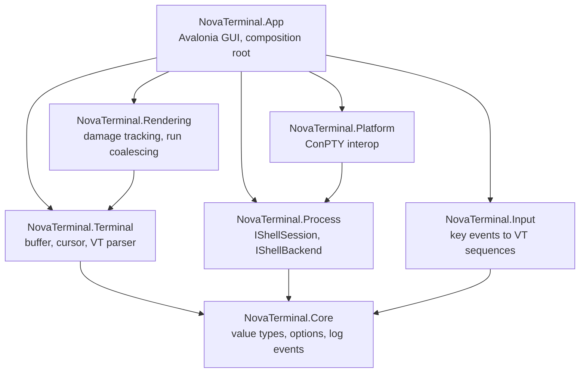
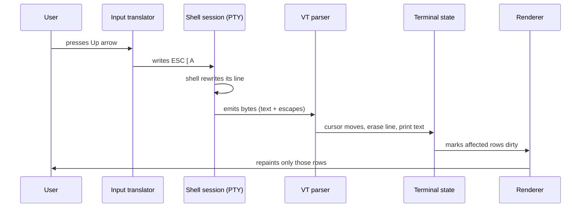

# NovaTerminal

A terminal emulator written from scratch in C# — virtual screen buffer, VT/ANSI escape-sequence
parser, pseudo-terminal process management and GPU-accelerated rendering, with no terminal-emulation
libraries underneath it.

<!-- Replace OWNER with your GitHub account to activate the badge. -->
[](https://github.com/OWNER/NovaTerminal/actions/workflows/ci.yml)
[](LICENSE)
[](https://dotnet.microsoft.com/)



---

## Project status

This project is built in public, milestone by milestone. The table below is the honest state of the
repository — nothing is listed as working until it is implemented and tested.

| # | Milestone | Status |
|---|-----------|--------|
| 1 | Project foundation: solution, layering, CI, tests | ✅ Done |
| 2 | Virtual terminal: cells, buffer, cursor, scrolling | ✅ Done |
| 3 | ANSI/VT parser state machine | ✅ Done |
| 4 | Terminal view and GUI | ✅ Done |
| 5 | Shell process launch | ⏳ Next |
| 6 | Shell ↔ terminal wiring | ⬜ Planned |
| 7 | Colours, cursor movement, clearing, scrolling | ⬜ Planned |
| 8 | ConPTY backend | ⬜ Planned |
| 9 | Resize support | ⬜ Planned |
| 10–18 | Copy/paste, scrollback, tabs, search, themes, performance, polish | ⬜ Planned |

## Features

Planned capabilities, in the order they arrive:

- **Real interactive shells.** PowerShell, `cmd.exe` and Unix shells running under a genuine
  pseudo-terminal, not redirected standard streams.
- **A from-scratch VT parser.** A state machine implementing the ECMA-48/DEC sequence grammar,
  resilient to sequences split arbitrarily across reads.
- **Full colour.** 16-colour, 256-colour and 24-bit true colour, plus bold, faint, italic,
  underline, inverse and strikethrough attributes.
- **Correct terminal semantics.** Scrolling regions, alternate screen buffer, cursor visibility and
  shape, tab stops, line wrapping.
- **Multiple sessions.** Independent tabs, each with its own buffer, shell and configuration.
- **Selection, copy and paste** operating on terminal text, not rendered pixels.
- **Scrollback with search.**
- **Configurable themes**, fonts and cursor behaviour.
- **Structured logging** and robust error handling throughout.

## Architecture

The core idea: a terminal emulator is a *parser driving a state machine*, with a GUI attached as an
observer. The shell has no idea a window exists — it writes bytes to a file descriptor, and every
visual effect is an in-band escape sequence inside that byte stream.

That is why the engine is strictly GUI-free: it is testable as `bytes in → screen state out`.



| Project | Responsibility |
|---------|----------------|
| `NovaTerminal.Core` | Value types (`TerminalSize`, `TerminalColor`, `TextAttributes`), the configuration model, log event IDs. Depends on nothing. |
| `NovaTerminal.Terminal` | The engine: screen buffer, cursor, terminal state, VT parser. No GUI, no OS calls. |
| `NovaTerminal.Process` | Platform-neutral shell abstractions: `IShellSession`, `IShellBackend`. |
| `NovaTerminal.Platform` | The only project containing native interop. Windows ConPTY today; Unix PTY later. |
| `NovaTerminal.Input` | Pure translation of key events into VT byte sequences. |
| `NovaTerminal.Rendering` | Toolkit-agnostic render model: cell geometry, styled runs, damage sets. |
| `NovaTerminal.App` | Avalonia application, windows and the composition root. |

Three rules hold the design together, and all three are **enforced by tests**, not by convention
(see [`LayeringTests`](tests/NovaTerminal.Integration.Tests/LayeringTests.cs) and
[`EnginePurityTests`](tests/NovaTerminal.Terminal.Tests/EnginePurityTests.cs)):

1. The engine references no GUI assembly.
2. Dependencies point downward only — the graph is acyclic.
3. Only `NovaTerminal.App` may reference a GUI toolkit.

Two decisions worth explaining:

**`NovaTerminal.Rendering` has no Avalonia dependency.** It converts a terminal snapshot into a
render model — coalesced styled runs plus a set of dirty rows — and the Avalonia control is a thin
adapter that draws that model. The expensive, bug-prone logic (run coalescing, damage computation)
stays unit-testable without a window.

**`NovaTerminal.Input` does not depend on the engine.** Key encoding varies with terminal *modes*
(application cursor keys, bracketed paste). Rather than reaching into the engine, modes are passed
in, making input a pure function: `(key, modifiers, modes) → bytes`.

## How it works



Note what is *not* in that loop: the GUI never mutates terminal state, and the engine never draws.
Each arrow is a one-way dependency.

## Terminal architecture

The engine models a VT-series terminal:

- A **screen buffer** of cells, each holding a character, a foreground colour, a background colour
  and attribute flags.
- A **cursor**: position, visibility, shape, and saved state.
- A **scrolling region** (top and bottom margins) that constrains scrolling.
- An **alternate screen buffer**, so full-screen programs like `vim` can take over the display and
  restore it on exit *(Milestone 12)*.
- A bounded **scrollback** ring of lines that have scrolled off the top *(Milestone 11)*.

Three rules in the engine are worth calling out, because they are what separate a terminal emulator
from a text box:

- **Deferred wrap.** Printing into the final column does not move the cursor. It stays put with a
  "pending wrap" flag, and only the *next* printable character wraps. Without this, output formatted
  to exactly the terminal width gains a blank line between every row.
- **Characters are not all one column wide.** `中` occupies two cells — a leading cell plus a
  placeholder — and a combining accent occupies none. Overwriting either half of a wide pair erases
  both, so a half-glyph can never desynchronise the rest of the line.
- **Erase uses the current background, not black.** `ESC[K` fills with the background colour
  currently selected by SGR but drops the other attributes, so clearing inside a coloured region
  keeps the colour without smearing underlines across blank space.

Cell density drives the memory profile, so colours are packed into a single `uint` (kind tag plus
payload) and attributes into a `ushort`. A 100×50 screen with 10,000 lines of scrollback holds over
a million colour values; keeping them as packed value types keeps the buffer contiguous,
cache-friendly and entirely off the GC's scanning path. `default` is deliberately meaningful — a
zeroed cell is a blank cell in theme colours, so allocating a buffer needs no initialisation pass.

## ANSI parser

Escape sequences arrive as a byte stream that has no respect for read boundaries. `"\x1b[31m"` may
arrive as one read, or as `"\x1b"`, `"[3"`, `"1m"`. The parser is therefore a **state machine that
retains state between reads** — never a routine that scans a buffer for complete sequences.

```mermaid
stateDiagram-v2
    [*] --> Ground
    Ground --> Escape: 0x1B
    Escape --> CsiEntry: '['
    Escape --> OscString: ']'
    Escape --> Ground: final byte
    CsiEntry --> CsiParam: digit / ';'
    CsiEntry --> Ground: final byte (execute)
    CsiParam --> CsiParam: digit / ';'
    CsiParam --> Ground: final byte (execute)
    OscString --> Ground: BEL or ESC '\'
    Ground --> Ground: printable text
```



Because terminal output is untrusted input, the parser treats it as such: parameter values and
parameter counts are bounded, unknown sequences are ignored rather than guessed at, and no sequence
can cause unbounded allocation. An escape sequence can never do anything other than change terminal
state.

## Process architecture

A pseudo-terminal is the difference between a terminal emulator and a program that merely runs
`cmd.exe` with redirected pipes. With redirected pipes, a shell detects it is not attached to a
terminal and disables interactivity: no prompt rendering, no line editing, no colour, no
`vim`. A PTY gives the child a real terminal device, so it behaves exactly as it would in a console.

On Windows this means **ConPTY** (`CreatePseudoConsole`, Windows 10 1809+). The
`NovaTerminal.Platform` project isolates that interop behind `IShellBackend`, so a Unix backend
using `openpty` can drop in without any other layer changing.

Output flows through a bounded channel: a shell producing output faster than the parser consumes it
applies backpressure rather than growing memory without limit.

## Rendering pipeline

1. The engine marks rows dirty as it mutates them.
2. The renderer takes a snapshot and coalesces each dirty row into **styled runs** — the longest
   spans sharing colours and attributes — so a row of plain text becomes one draw call rather than
   eighty.
3. The Avalonia control draws only those runs, plus the cursor.

`CellMetrics` is the single place where pixels and cells meet: above it the GUI works in
device-independent pixels, below it everything works in rows and columns.

## Building

Requires the [.NET 10 SDK](https://dotnet.microsoft.com/download) or newer.

```bash
git clone https://github.com/OWNER/NovaTerminal.git
cd NovaTerminal
dotnet build
```

## Running

```bash
dotnet run --project src/NovaTerminal.App
```

Logs are written to `%LOCALAPPDATA%\NovaTerminal\logs` on Windows and
`~/.local/share/NovaTerminal/logs` elsewhere.

## Testing

```bash
dotnet test
```

The suite covers value-type invariants, configuration validation, cell geometry, platform capability
detection, and the architectural rules described above. Later milestones add buffer semantics,
parser conformance (including sequences split across reads) and shell integration tests.

## Performance

Performance targets, to be measured with BenchmarkDotNet in Milestone 15 — no numbers are published
here until they are measured:

- Parsing throughput on large output streams (`cat` of a large file, `dir /s`).
- Buffer mutation and scrolling cost.
- Frame time under sustained output.
- Memory held by a full scrollback buffer.

The design decisions that serve those targets — packed cells, damage-based repainting, run
coalescing, bounded channels — are described above.

## Roadmap

See the milestone table under [Project status](#project-status), and
[CHANGELOG.md](CHANGELOG.md) for what has landed.

## Contributing

Contributions are welcome — see [CONTRIBUTING.md](CONTRIBUTING.md) for the build, style and testing
expectations, and [CODE_OF_CONDUCT.md](CODE_OF_CONDUCT.md).

## License

[MIT](LICENSE).
