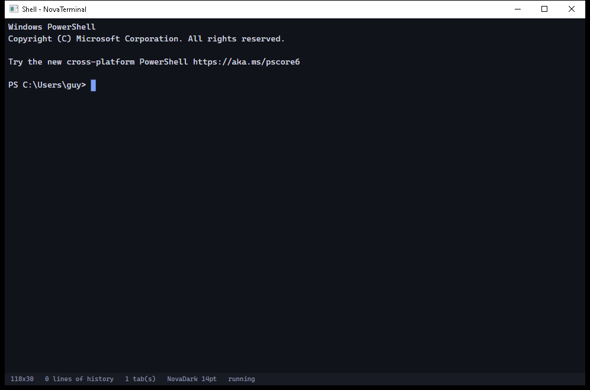
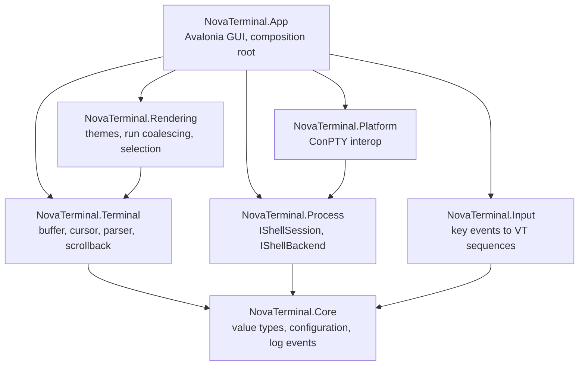
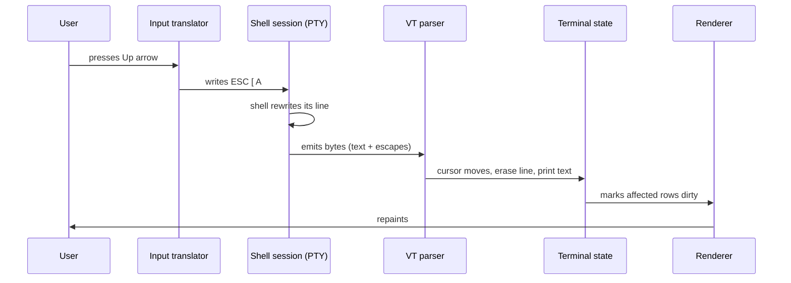

# NovaTerminal

A terminal emulator written from scratch in C# — virtual screen buffer, VT/ANSI escape-sequence
parser, pseudo-terminal process management and custom-drawn rendering, with no terminal-emulation
libraries underneath it.

<!-- Replace OWNER with your GitHub account to activate the badge. -->
[](https://github.com/OWNER/NovaTerminal/actions/workflows/ci.yml)
[](LICENSE)
[](https://dotnet.microsoft.com/)



*PowerShell running inside NovaTerminal. Real pseudo-terminal, real shell; every character on that
screen was parsed, stored and drawn by code in this repository.*

---

## Features

- **Real interactive shells** through a genuine pseudo-terminal (ConPTY), not redirected standard
  streams. Prompts, line editing, tab completion, colour and full-screen programs all work, because
  the shell cannot tell it is not attached to a console.
- **A from-scratch VT parser** implementing the ECMA-48/DEC grammar as a state machine, resilient to
  sequences split arbitrarily across reads.
- **Full colour** — 16-colour, 256-colour and 24-bit true colour, in both the semicolon and colon
  spellings — plus bold, faint, italic, underline, blink, inverse, invisible and strikethrough.
- **Correct terminal semantics**: deferred wrap, scrolling regions, the alternate screen buffer,
  origin and insert modes, DEC Special Graphics, tab stops, and double-width characters.
- **Scrollback** with mouse-wheel and keyboard scrolling, bounded by configuration.
- **Selection, copy and paste** operating on terminal text — including block selection, word and
  line selection, and bracketed paste.
- **Search** across the whole history.
- **Tabs**, each with its own engine, scrollback, shell and pump.
- **Themes and configuration** from a JSON file, with user-defined themes.
- **Structured logging** through source-generated log methods, and error handling that degrades
  rather than disappears.

## Keyboard

| Shortcut | Action |
|---|---|
| `Ctrl+Shift+C` / `Ctrl+Shift+V` | Copy / paste |
| `Ctrl+Shift+A` | Select all |
| `Ctrl+Shift+F` | Find in scrollback (`Enter` / `Shift+Enter` for next / previous) |
| `Ctrl+Shift+T` / `Ctrl+Shift+W` | New tab / close tab |
| `Ctrl+Tab` / `Ctrl+Shift+Tab` | Next / previous tab |
| `Ctrl+Shift+P` | Cycle theme |
| `Ctrl+=` / `Ctrl+-` / `Ctrl+0` | Font larger / smaller / reset |
| `Shift+PageUp` / `Shift+PageDown` | Scroll history |

`Ctrl+Shift` is the terminal convention for the emulator's own shortcuts, precisely because plain
`Ctrl` combinations belong to the program running inside.

## Architecture

A terminal emulator is a *parser driving a state machine*, with a GUI attached as an observer. The
shell has no idea a window exists — it writes bytes to a file descriptor, and every visual effect is
an in-band escape sequence inside that byte stream.

That is why the engine is strictly GUI-free: it is testable as `bytes in → screen state out`.



| Project | Responsibility |
|---------|----------------|
| `NovaTerminal.Core` | Value types, the configuration model, log event IDs. Depends on nothing. |
| `NovaTerminal.Terminal` | The engine: buffer, cursor, state, parser, scrollback, search. No GUI, no OS calls. |
| `NovaTerminal.Process` | Platform-neutral shell abstractions: `IShellSession`, `IShellBackend`. |
| `NovaTerminal.Platform` | The only project containing native interop. Windows ConPTY today. |
| `NovaTerminal.Input` | Pure translation of key events into VT byte sequences. |
| `NovaTerminal.Rendering` | Toolkit-agnostic render model: themes, styled runs, selection, cell geometry. |
| `NovaTerminal.App` | Avalonia application, tabs, windows, composition root. |

Three rules hold the design together, and all three are **enforced by tests** rather than
convention — see [`LayeringTests`](tests/NovaTerminal.Integration.Tests/LayeringTests.cs) and
[`EnginePurityTests`](tests/NovaTerminal.Terminal.Tests/EnginePurityTests.cs):

1. The engine references no GUI assembly.
2. Dependencies point downward only — the graph is acyclic.
3. Only `NovaTerminal.App` may reference a GUI toolkit.

## How it works



The GUI never mutates terminal state, and the engine never draws. Each arrow is a one-way
dependency.

## Terminal architecture

Three rules in the engine are what separate a terminal emulator from a text box:

- **Deferred wrap.** Printing into the final column does not move the cursor. It stays put with a
  "pending wrap" flag, and only the *next* printable character wraps. Without this, output formatted
  to exactly the terminal width gains a blank line between every row.
- **Characters are not all one column wide.** `中` occupies two cells — a leading cell plus a
  placeholder — and a combining accent occupies none. Overwriting either half of a wide pair erases
  both, so a half-glyph can never desynchronise the rest of the line.
- **Erase uses the current background, not black.** `ESC[K` fills with the background colour
  currently selected by SGR but drops the other attributes, so clearing inside a coloured region
  keeps the colour without smearing underlines across blank space.

Cell density drives the memory profile, so colours pack into a single `uint` and attributes into a
`ushort`, giving a 16-byte cell. A 100×50 screen with 10,000 lines of scrollback holds over a
million cells; keeping them as packed value types keeps the buffer contiguous, cache-friendly and
entirely off the garbage collector's scanning path. `default` is deliberately meaningful — a zeroed
cell is a blank cell in theme colours, so allocating a buffer needs no initialisation pass.

Scrolling rotates line *references* and recycles the vacated line, so it allocates nothing. When
scrollback is enabled the line leaving the screen enters history and the line leaving history is
reused in its place.

## ANSI parser

Escape sequences arrive as a byte stream with no respect for read boundaries. `ESC[31m` may arrive
whole, or as `ESC`, `[3`, `1m`. The parser is therefore a **state machine that retains state between
reads** — never a routine that scans a buffer for complete sequences.

```mermaid
stateDiagram-v2
    [*] --> Ground
    Ground --> Escape: 0x1B
    Escape --> CsiEntry: '['
    Escape --> OscString: ']'
    Escape --> DcsEntry: 'P'
    Escape --> Ground: final byte
    CsiEntry --> CsiParam: digit / ; / :
    CsiEntry --> CsiIgnore: bad byte
    CsiParam --> Ground: final byte (dispatch)
    CsiIgnore --> Ground: final byte (discarded)
    OscString --> Ground: BEL or ST
    DcsEntry --> DcsPassthrough: final byte
    DcsPassthrough --> Ground: ST
```

It follows Paul Williams' VT500 model. The states that look redundant are what make malformed input
safe: `CsiIgnore` consumes a bad sequence up to its final byte so it cannot swallow the text after
it, and `DcsPassthrough` consumes device-control payloads that would otherwise be executed as
commands.

Two things beyond the diagram:

- **UTF-8 also spans reads**, and is decoded with the same resumability. Overlong encodings and
  surrogate halves are rejected rather than decoded leniently, because accepting them is a
  well-known way to smuggle characters past anything inspecting the stream.
- **Colons introduce SGR sub-parameters** rather than routing to `CsiIgnore`, so `38:2::255:0:0`
  works alongside `38;2;255;0;0`. Both appear in real output.

Terminal output is untrusted, so parameter values saturate rather than overflow, parameter counts
and string payloads are capped, unknown sequences are ignored, and each distinct unsupported
sequence is logged at most once.

## Process architecture

A pseudo-terminal is the difference between a terminal emulator and a program that runs `cmd.exe`
with redirected pipes. Given a pipe, a shell detects it is not attached to a terminal and disables
almost everything that makes it interactive: no prompt rendering, no line editing, no colour, no
full-screen programs. There is also no way to tell a piped child that the window resized.

On Windows this means **ConPTY**. `NovaTerminal.Platform` isolates that interop behind
`IShellBackend`, so a Unix backend using `openpty` can drop in without any other layer changing.

Two findings from building it, both recorded in [docs/troubleshooting.md](docs/troubleshooting.md):

- `PROC_THREAD_ATTRIBUTE_PSEUDOCONSOLE` takes the handle **by value**, unlike most attributes which
  take a pointer to the value. Passing a pointer makes `CreateProcess` succeed and the child then
  die during start-up with `STATUS_DLL_INIT_FAILED`.
- **A process that owns a console cannot bind a child to a pseudo console.** The child attaches to
  the inherited console instead, and `FreeConsole` does not undo it. NovaTerminal is a GUI
  executable so it is unaffected — but it is why the ConPTY tests run out of process.

## Rendering pipeline

1. The engine marks rows dirty as it mutates them.
2. `RowRunBuilder` coalesces each row into maximal runs of identical style, so a row of plain text
   is one text-drawing call rather than eighty. It reuses its buffers, so a frame allocates nothing.
3. The Avalonia control draws those runs, the selection overlay and the cursor.

The render model has no GUI dependency, which is what lets run coalescing, theme resolution,
selection and cell geometry all be tested without a window. `CellMetrics` is the single place where
pixels and cells meet.

## Concurrency

| Concern | Approach | Why |
|---------|----------|-----|
| Shell output | Bounded `Channel<byte[]>`, single consumer | Backpressure instead of unbounded buffering when a command floods faster than it can be parsed |
| Reading the PTY | One dedicated thread | The pipes behind a pseudo console do not support overlapped I/O; an "async" read would just block a thread-pool thread instead |
| Engine mutation | Only ever on the UI thread | No locks on the hot path, and the renderer can never observe a half-applied escape sequence |
| Output delivery | Drained in batches | A flood becomes one repaint rather than hundreds |
| Resize | Engine first, then the pseudo console | A full-screen program must not paint into a buffer that no longer matches |
| Shutdown | `CancellationToken` plus closing handles | A blocking pipe read cannot be cancelled; closing the handle is what unblocks it |

The principle throughout is to prefer *ownership* to *locking*. A lock says "several threads touch
this"; a channel says "exactly one thread touches this, and here is how work reaches it".

## Configuration

Settings live in `%APPDATA%\NovaTerminal\settings.json`, written on first run. Comments and trailing
commas are accepted, because the file is meant to be edited by a person.

```jsonc
{
  "Appearance": {
    "FontFamily": "Cascadia Mono, Consolas, monospace",
    "FontSize": 14,
    "ThemeName": "NovaDark",
    "CursorStyle": "Block",   // Block, Underline or Bar
    "CursorBlink": true
  },
  "Terminal": {
    "ScrollbackLines": 5000,  // Bounded: terminal output can be infinite
    "TabWidth": 8,
    "TermName": "xterm-256color"
  },
  "Shell": {
    "Executable": null,       // null selects PowerShell, then cmd.exe
    "Arguments": []
  },
  "Themes": {
    "NovaDark": { "Background": "#0B0D12" }   // Overrides one colour of a built-in theme
  }
}
```

A bad settings file never stops the terminal starting: unparseable files fall back to defaults,
individually invalid values fall back on their own, and every problem is reported rather than
thrown. The terminal is the tool you would need in order to fix it.

## Building

Requires the [.NET 10 SDK](https://dotnet.microsoft.com/download).

```bash
git clone https://github.com/OWNER/NovaTerminal.git
cd NovaTerminal
dotnet build
```

## Running

```bash
dotnet run --project src/NovaTerminal.App
```

Logs are written to `%LOCALAPPDATA%\NovaTerminal\logs`.

## Testing

```bash
dotnet test
```

474 tests. The engine and parser are tested as `bytes in → screen state out`, with no GUI and no
shell involved:

- **Parser** — every control function, malformed input, and a case that splits a sequence at *every*
  possible byte boundary and asserts the event stream is identical each time.
- **Robustness** — 200 fuzz iterations of random bytes and of randomly generated escape sequences,
  asserting that nothing throws and that the screen invariants a renderer relies on still hold.
- **Engine** — wrapping, scrolling regions, wide-character corruption, erase semantics, resize.
- **Architecture** — the layering rules above, which fail the build if violated.
- **Shell** — a real `cmd.exe` in a real pseudo terminal, driven out of process.

Tests run on Microsoft.Testing.Platform rather than the VSTest bridge, which was observed reporting
a run as fully passing while five tests were failing and silently dropped from the report.

## Performance

Measured with BenchmarkDotNet on .NET 10, Windows 10 (x64). Run them yourself with:

```bash
dotnet run -c Release --project benchmarks/NovaTerminal.Benchmarks
```

1,000 lines of output per operation, short job:

| Workload | Mean | Allocated |
|---|---:|---:|
| Plain text (~45 KB) | 722 µs | 0 B |
| Coloured output | 530 µs | 0 B |
| Full-screen redraw | 190 µs | 0 B |
| Double-width text | 530 µs | 0 B |

Roughly 60 MB/s of plain text, and **zero allocations on every path** — the packed cells, recycled
lines and reused run buffers all show up here.

One measurement changed a decision. Batching printable ASCII in the parser looked like an obvious
win; it made no difference at all. A benchmark that printed the same text with *no parser* cost
647 µs against 722 µs through the parser, so parsing was only 13% of the time and the optimisation
was aimed at the wrong place. It was reverted. Removing redundant bounds checks on the engine's
write path — the actual 87% — gave 3–12%.

## Roadmap

| # | Milestone | Status |
|---|-----------|--------|
| 1 | Project foundation: solution, layering, CI, tests | ✅ |
| 2 | Virtual terminal: cells, buffer, cursor, scrolling | ✅ |
| 3 | ANSI/VT parser state machine | ✅ |
| 4 | Rendering pipeline and terminal view | ✅ |
| 5, 8 | ConPTY shell backend | ✅ |
| 6 | Shell ↔ terminal wiring, keyboard input | ✅ |
| 7 | Alternate screen, character sets, modes | ✅ |
| 9 | Resize | ✅ |
| 10 | Selection, copy and paste | ✅ |
| 11 | Scrollback | ✅ |
| 12 | Tabs | ✅ |
| 13 | Search | ✅ |
| 14 | Themes and configuration | ✅ |
| 15 | Benchmarks and optimisation | ✅ |
| 16 | Fuzz and robustness tests | ✅ |
| 17 | CI and release workflows | ✅ |
| 18 | Documentation and polish | ✅ |

Not done, and worth knowing about:

- **Unix backend.** The abstraction is in place; only `openpty` and a session implementation are
  missing.
- **Combining characters** are discarded rather than attached to the preceding cell. They correctly
  occupy no columns, so layout stays in sync, but an accent is lost. A cell would need to hold a
  grapheme cluster rather than a single scalar.
- **Reflow on resize.** Wrapped lines are not re-wrapped when the window width changes; the
  `IsWrapped` flag needed to do it is already recorded.
- **Sixel and other DCS functions** are recognised and discarded.
- **Mouse reporting** to the child program.

## Documentation

- [Architecture](docs/architecture.md) — the reasoning, and the decisions that could have gone
  another way.
- [Troubleshooting](docs/troubleshooting.md) — including the two ConPTY findings above.
- [Contributing](CONTRIBUTING.md) — build, style and testing expectations.
- [Changelog](CHANGELOG.md).

## License

[MIT](LICENSE).
