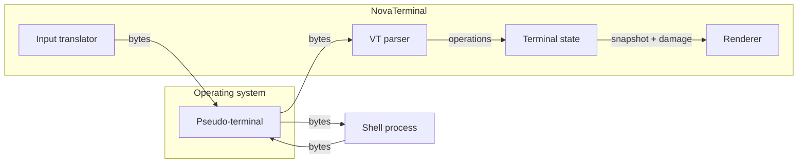
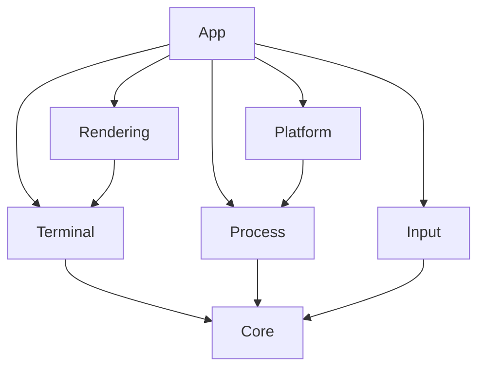

# NovaTerminal architecture

This document explains how NovaTerminal is put together and why. The README summarises the design;
this goes into the reasoning, including the decisions that could reasonably have gone another way.

## 1. What a terminal emulator actually is

It helps to be precise about the problem, because the name is misleading. A terminal emulator does
not "run commands". It emulates a piece of 1970s hardware — a VT100-family video terminal — on
behalf of a program that thinks it is talking to one.

Three separate things are involved:

1. **The shell** (`pwsh`, `bash`, `cmd`) — an ordinary program that reads bytes from an input device
   and writes bytes to an output device.
2. **The terminal device** — provided by the operating system. It is what makes the shell believe a
   human is present, and it is what carries the signals (`Ctrl+C`, window size changes) that
   interactive programs depend on.
3. **The emulator** — our application. It renders the byte stream coming out of the device, and
   turns keystrokes into the byte stream going in.

Everything visual — colour, cursor position, clearing the screen, `vim` taking over the display — is
encoded *in band*, as escape sequences mixed into the same byte stream as the text. There is no
side channel. This single fact determines the whole architecture: the emulator's job is to parse a
byte stream into state changes, and to render that state.

## 2. Why a pseudo-terminal, and not redirected pipes

The naive approach is `ProcessStartInfo { RedirectStandardOutput = true }`. It appears to work and
then fails at everything that matters.

A program can ask whether its output is a terminal (`isatty` on Unix; on Windows, whether the handle
is a console handle). Shells use the answer to decide how to behave. Given a pipe, a shell:

- prints no prompt, or prints it without formatting;
- disables line editing, so arrow keys and tab completion do nothing;
- disables colour;
- refuses to run full-screen programs at all.

There is also no way to tell a piped child that the window resized, and no way to deliver `Ctrl+C`
as a signal rather than as the byte `0x03`.

A pseudo-terminal solves this by providing a real terminal device with two ends. The child gets the
*slave* end and cannot tell it apart from hardware. The emulator holds the *master* end and reads
whatever the child writes.

One consequence worth noting: a PTY merges stdout and stderr into a single stream, deliberately.
That is why `IShellSession` exposes exactly one output channel — separating them would be
*less* faithful, not more.

On Windows the mechanism is **ConPTY** (`CreatePseudoConsole`, Windows 10 1809 / build 17763). It is
notably different in shape from the Unix `openpty` family, which is why the abstraction seam
(`IShellBackend`) sits above both rather than trying to make one look like the other.

## 3. The layering, and why it is enforced by tests

The rule that matters most: **the terminal engine has no GUI dependency**. The engine is a pure
function from a byte stream to screen state. That makes it:

- testable exhaustively without a window, at thousands of cases per second;
- benchmarkable in isolation, so parsing cost is measurable separately from drawing cost;
- reusable by a different front end.

Architectural rules that live only in a document decay, because nothing stops a well-intentioned
change from breaking one. So the rules are asserted:

| Test | Rule |
|------|------|
| `EnginePurityTests` | `Core` and `Terminal` reference no GUI assembly at runtime |
| `LayeringTests.NoProjectReferencesOutsideItsAllowedSet` | The permitted dependency edges, as data |
| `LayeringTests.DependencyGraphIsAcyclic` | Dependencies point downward only |
| `LayeringTests.OnlyTheApplicationReferencesTheGuiToolkit` | Avalonia stays in `App` |
| `LayeringTests.EveryPackageVersionIsManagedCentrally` | No project pins its own package version |

`LayeringTests` reads the `.csproj` files rather than the compiled assemblies, deliberately: the
compiler omits unused references from assembly metadata, so a metadata-only check would miss a
declared-but-not-yet-used dependency — exactly the coupling that is easiest to introduce by
accident.

## 4. Data representation

The screen buffer dominates memory use. A 100×50 screen with 10,000 lines of scrollback is over a
million cells, each with a character, two colours and attribute flags.

`TerminalColor` therefore packs into a single `uint`: a one-byte kind tag (`Default`, `Indexed`,
`Rgb`) plus a 24-bit payload. `TextAttributes` is a `ushort`-backed flags enum. Both are value
types, so the buffer stays contiguous, cache-friendly and invisible to the garbage collector.

The `Default` colour kind is not an optimisation detail — it is semantically required. `SGR 39`
resets the foreground to "the terminal's default", which is a property of the *theme*, not of the
data. A cell coloured "default" must repaint when the theme changes; a cell coloured "white" must
not. Collapsing the two would be a correctness bug, not just a lost optimisation.

A useful consequence: `default(TerminalColor)` is `Default`, and a zeroed cell is a blank cell in
theme colours. Allocating or clearing a buffer needs no initialisation pass.

## 5. Concurrency model

Several things run at once: the shell writes output whenever it likes, the user types, the window
resizes, and the GUI repaints on its own schedule. The approach is to keep mutable state
single-threaded and move data between threads over explicit channels, rather than to share state
under locks.

| Concern | Approach | Reasoning |
|---------|----------|-----------|
| Shell output | Bounded `Channel<byte[]>`, single consumer | Backpressure instead of unbounded buffering when a command floods output faster than it can be parsed |
| Terminal state mutation | One pump loop owns the engine | The engine needs no internal locking, so parsing stays fast and free of lock-ordering bugs |
| Rendering | Reads a snapshot plus a damage set | The GUI never mutates engine state, so there is no writer to race with |
| Resize | Serialised through the same pump as output | A resize interleaved with a partially parsed sequence is a classic terminal corruption bug |
| Shutdown | `CancellationToken` through every async path | Closing a tab must terminate its pump promptly and deterministically |

The general principle: prefer *ownership* to *locking*. A lock says "several threads touch this"; a
channel says "exactly one thread touches this, and here is how work reaches it". The second is far
easier to reason about, and considerably faster on the hot path.

## 6. Untrusted input

Terminal output is untrusted. It may come from a remote host over SSH, from a file someone else
wrote, or from a program deliberately emitting hostile sequences. The parser is therefore treated as
a security boundary:

- Escape sequences change terminal state and nothing else. No sequence executes anything.
- Numeric parameters are range-checked before use; `VtConstants.MaxParameterValue` bounds a single
  parameter and `MaxParameterCount` bounds how many are retained.
- Unknown sequences are ignored, not guessed at, and logged at debug level so that hostile output
  cannot flood the log.
- Scrollback is bounded by configuration with a hard ceiling
  (`TerminalBehaviorOptions.MaxScrollbackLines`), so an infinite output stream cannot exhaust memory.

## 7. Decisions

### D1: Avalonia for the GUI

Chosen over WPF (Windows-only) and WinForms (poor text rendering control, no GPU compositing).
Avalonia gives GPU-accelerated custom drawing, runs on Windows, Linux and macOS, and lets the
terminal view be a single custom-drawn control rather than a tree of thousands of text elements.

### D2: `NovaTerminal.Rendering` contains no Avalonia reference

The rendering *pipeline* — turning a buffer snapshot into coalesced styled runs and a damage set —
is toolkit-independent logic and the part most likely to contain subtle bugs. Keeping it free of
Avalonia makes it unit-testable. The Avalonia control that consumes the render model lives in `App`,
where GUI code belongs.

The cost is one extra indirection between engine and screen. The benefit is that the hardest part of
rendering can be tested without a display.

### D3: `NovaTerminal.Input` does not depend on the engine

Key encoding depends on terminal modes — application cursor keys (DECCKM) change `Up` from
`ESC [ A` to `ESC O A`, and bracketed paste changes how pasted text is framed. Rather than let the
input layer reach into engine state, modes are passed in as an immutable struct, making encoding a
pure function of `(key, modifiers, modes)`. Pure functions are trivially testable, and the whole
xterm key table can be verified as data.

### D4: The project is named `NovaTerminal.Process` despite shadowing `System.Diagnostics.Process`

Inside the `NovaTerminal.Process` namespace, the identifier `Process` resolves to the namespace, so
`System.Diagnostics.Process` needs an alias there. That is a small, local cost, and the name is the
clearest description of the layer. Where the type is needed, the file declares
`using SysProcess = System.Diagnostics.Process;`.

### D5: Source-generated logging everywhere

Every log call goes through a `[LoggerMessage]` partial method. The generator emits a cached
delegate and a level check, so a disabled log costs no allocation and no template parsing. On the
parse and render paths — which run thousands of times a second — that is the difference between a
debug log being free and being a performance problem.

### D6: `.sln` rather than the newer `.slnx`

The .NET 10 SDK now defaults to the XML `.slnx` solution format. NovaTerminal uses the classic
`.sln` because it is understood by every version of every tool someone might clone this repository
with. The gain from `.slnx` is cosmetic; the compatibility cost is not.

### D7: One thread owns the engine

Terminal state is mutated only on the UI thread. The background pump reads bytes from the
pseudo-terminal and hands them over; it never touches the engine.

The alternative - locking the engine - would have meant the renderer could observe a half-applied
escape sequence, a resize could interleave with one, and the hot path would pay for a lock on every
character. Single ownership removes the whole class of problem instead of managing it. Backpressure
falls out of the same design: the pump awaits the UI thread, so while a repaint is in progress
nothing is drained and the bounded channel fills, which the reader feels as a slower pipe.

### D8: The ConPTY tests run out of process

A process that owns a console cannot bind a child to a pseudo console: the child attaches to the
inherited console instead, and `FreeConsole` does not undo it. xUnit v3 requires a console test
host, so the ConPTY path cannot be exercised from inside the test process at all.

`tests/NovaTerminal.PtyHarness` is a GUI-subsystem executable that runs the real scenario against
the real backend and reports through a file, which the integration tests assert on. The alternative
was to test a mock, which would have verified nothing: no test double can tell you whether
`UpdateProcThreadAttribute` was called with the right argument shape - and it was not, for a while.

### D9: Tests run on Microsoft.Testing.Platform, not the VSTest bridge

Running xUnit v3 through the VSTest adapter reported `Passed! - Failed: 0, Passed: 94` while five
tests were failing; they were dropped from the report rather than counted. A harness that
under-reports failures is worse than no harness, because it converts a broken build into a green
one. The native runner reports them.

### D10: Rendering the view, not the buffer

The renderer asks the engine for "row *n* of the current view" rather than for a buffer row. When
the user has scrolled back, the top rows come from history and the rest from the live screen, and
the renderer never learns which is which.

That keeps scrollback out of the rendering path entirely: no offset arithmetic in the drawing code,
no special cases, and one place - `TerminalState.GetViewRow` - where the two sources are joined.

### D11: A benchmark reversed an optimisation

Batching printable ASCII runs in the parser looked like an obvious improvement and was implemented
before being measured. It made no difference: 748 microseconds before, 756 after, well inside the
error bars.

A second benchmark printing the same text with no parser at all cost 647 microseconds, which said
the parser accounted for about 13% of the time and the optimisation had been aimed at the wrong
layer. It was reverted rather than kept "because it should help". Removing redundant bounds checks
from the engine's write path - the actual 87% - produced 3 to 12% depending on the workload.

The general rule this illustrates: an optimisation that cannot be demonstrated is complexity with a
story attached.
